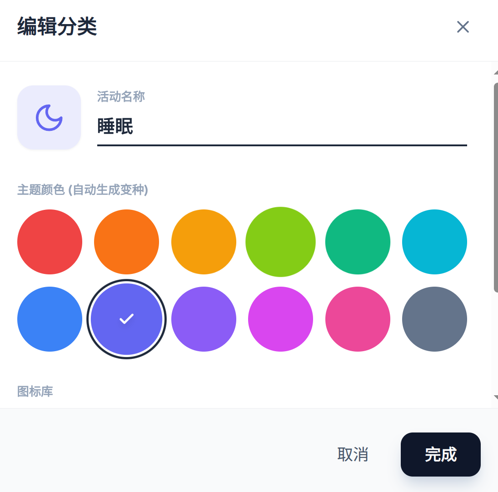
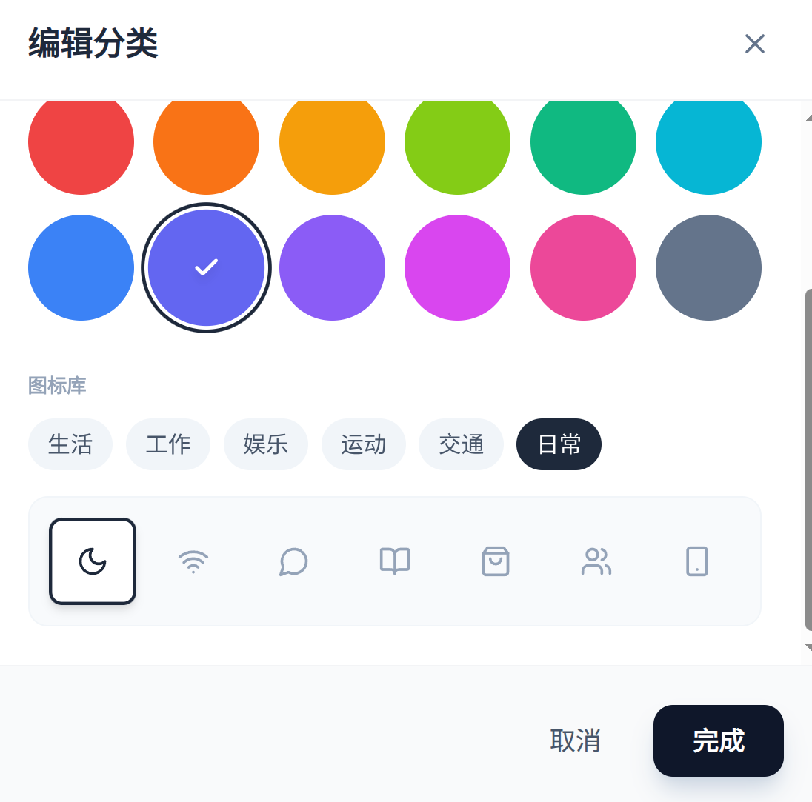

## v1.0

参考流珀开发文档.md和开发规范.md的规范，完成基本的分类管理页面和功能的开发，轻量化开发不要写多余的代码和防御性代码。

目标app能读取和加载分类管理配置，能够增删改活动配置。

## v1.1
分类管理ui优化升级

扩展图标和颜色数量，美化分类管理界面显示。

维护 12 个“种子颜色”，然后用代码自动生成 4 个变种（浅、中、深、强调）。图标按业务场景（如：生活、工作、娱乐、物体、运动、交通、日常生活等）分类，图标总共需要100-200个。

初始默认活动有十四个 睡眠 上网 工作 通勤 用餐 运动 娱乐 家务 游戏 影音 聊天 休息 学习 购物 

分类管理界面展示活动用一个个方格显示。
ui设计参考  

## v1.2

分类管理的 UI/逻辑分离不够彻底，主要问题如下：

CategoryEditorSheet 状态管理过于集中（最严重）：
这是一个 StatefulWidget，内部维护所有表单状态（_nameController、_colorSeed、_group 等）。

业务逻辑滞留在 UI：
颜色变种切换、数据校验、构建 CategoryFormValue 等逻辑写在 Widget 里，脱离 UI 难以测试。

数据流向耦合：
父组件通过 onSubmit 回调接收数据，但数据拼装完全发生在 UI 内。

文件结构命名与归类不当：
views/weight 拼写错误，应调整为 widgets。

静态配置混入 UI 层：
category_icons.dart、category_colors.dart 包含静态数据与辅助逻辑（如 resolveCategoryColorSeed），属于领域层或配置层，不应放在 views。

ViewModel 职责单一但缺位：
CategoriesViewModel 仅负责列表增删改查，编辑页的完整状态流（初始值 -> 修改 -> 校验 -> 提交）缺失，导致 UI 扛全部逻辑。

UI 组件复用性不足：
CategoriesContent 中 SliverGrid 的 delegate 逻辑混合了 AddTile 与 GridTile，拆分困难。

二、重构优化方案
1. 推荐目录结构
采用 Feature-First + MVVM，将 models / repositories / view_models / views 统一：

Plaintext

lib/features/categories/
├── models/                     <-- 业务实体 + 静态配置
│   ├── category.dart
│   ├── category_colors.dart
│   ├── category_icons.dart
│   └── category_options.dart
├── repositories/               <-- 数据获取与持久化
│   └── category_repository.dart
├── view_models/                <-- 状态管理 (ViewModel/Notifier)
│   ├── categories_list_provider.dart
│   └── category_editor_provider.dart
└── views/                      <-- UI 层
    ├── categories_page.dart
    ├── dialogs/
    │   └── category_editor_sheet.dart
    └── widgets/
        ├── categories_content.dart
        ├── categories_grid.dart
        ├── category_item_tile.dart
        └── editor_components/
            └── category_editor_components.dart

2. 核心重构点：引入 Editor Provider
目标是让 CategoryEditorSheet 成为“哑组件”，只展示状态、转发用户操作。

Step A：移动配置逻辑到 models 层
将 category_icons.dart 和 category_colors.dart 移出 UI 目录，保持纯数据/逻辑。

Step B：新增 CategoryEditorProvider（view_models 层）
负责编辑表单的“草稿状态”管理与校验。

Step C：重构 UI（CategoryEditorSheet）
UI 只读状态并调用 Provider 更新。

3. 优化 CategoriesContent
将 Grid Delegate 逻辑拆分，不要混在 build 方法里。

## v1.3

1. 性能优化：网格懒加载， categories_grid.dart使用 SliverChildBuilderDelegate，删掉 _buildTiles 方法。
2. category_colors.dart 文件里混杂了 Model 定义（Enum, Class）和 纯计算逻辑（_tint, _shade, _accent, _toHex）。 为了保持 Model 的纯净，将颜色计算逻辑移入到core/Utils。
3. SeedPalette 和 VariantPalette 的代码结构有 90% 是重复的（都是标题 + Wrap + ColorDot）,可以合并为一个通用的 ColorPalette 组件

## v1.4

分类管理页面的「自定义你的时间记录活动类型」 和 「点击活动可编辑配置」这两个文本删掉。
使用reorderable_grid_view这个包，让实现分类管理页面的活动能实现拖拽排序的功能。
新建一个Viewmodel去管理拖拽排序的逻辑。
新增活动这个按钮从 Grid 的 children 中移出去，改为固定按钮放在右上角，不需要文字提示，一个加号图标按钮就行。

