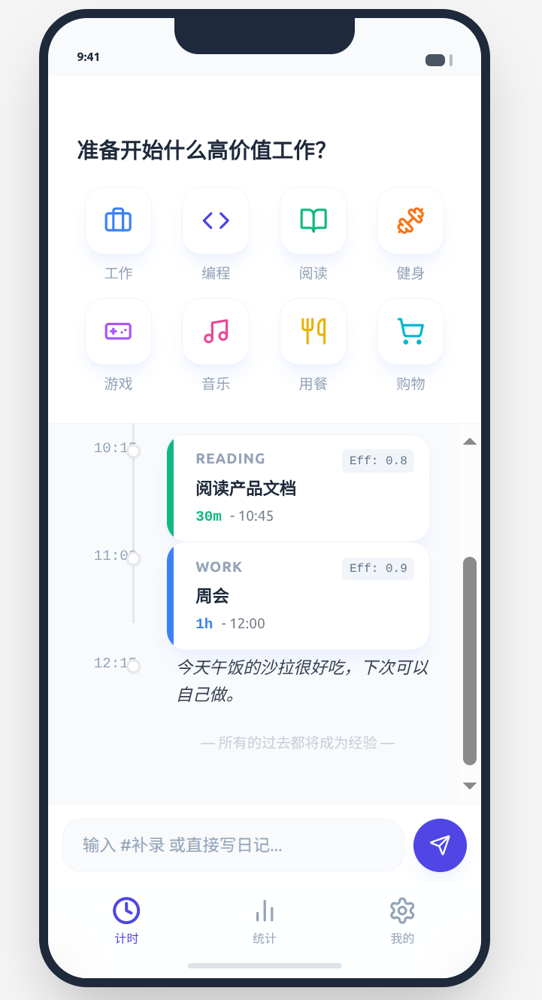
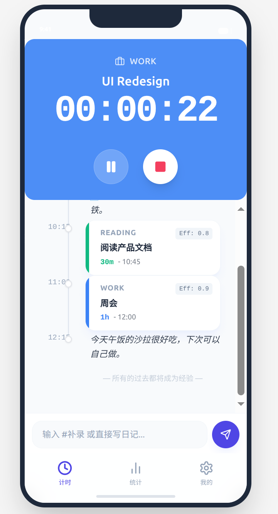

## v2.0
完善一下ui，参考 

以下是具体的 UI 设计方案与交互逻辑：

1. 整体布局架构 (The Layout)

想象屏幕被分为三个部分：

Zone A：顶部状态/操作区 (Pinned Top)

这里是**“当下 (Now)”**。

空闲时：显示常用分类网格（Quick Start Grid），方便一键开始。

计时中：显示巨大的计时器、当前任务名、暂停/停止按钮。

Zone B：中间时间流 (Scrollable Body)

这里是**“过去 (Today)”**。

展示当天的混合列表（TimeRecord + Note）。

是的，日记一定要展示在这里。 看着时间轴不断变长，会产生极大的成就感，同时能帮你回忆起刚才做事的上下文。

Zone C：底部输入栏 (Pinned Bottom)

这里是**“补录/备注 (Input)”**。

常驻底部的 Smart Input Bar。

2. 详细 UI 设计分解

Zone A: 顶部计时器设计 (两种状态)

这是你问的“计时器怎么放”的核心。它不是一个悬浮球，而是占据页面顶部约 1/4 ~ 1/3 的固定区域。

状态 1：空闲态 (Idle State)

标题：“准备开始什么高价值工作？”

内容：一个 2行4列 的图标网格（Category Grid）。

每个格子包含：[Icon] + [分类名]。

交互：点击图标 -> 弹出对话框输入“具体内容” -> 点击“开始” -> 切换到状态 2。

视觉：干净、色彩鲜明（对应分类颜色）。

状态 2：计时态 (Running State)

背景：变为对应分类的主题色（例如编程是深蓝，背景变深蓝，文字变白）。

核心元素：

主时间：00:45:23 (巨大的等宽字体，单色)。

任务名：重构首页 UI (中号字体)。

控制栏：

[⏸ 暂停] (点击后时间变灰，闪烁)。

[⏹ 停止] (点击后弹出结算弹窗，确认权重)。

设计巧思：计时器区域可以稍微大一点，给足“沉浸感”，暗示你现在正处于“Focus Mode”。

Zone B: 中间日记/时间轴设计 (The Unified Timeline)

这里是数据展示区。采用类似聊天软件或 Twitter 的时间轴样式。

列表项设计：

左侧：时间戳 (e.g., 10:30)。

中间：一条垂直贯穿的细线（Timeline），将所有卡片串起来。

右侧：卡片内容。

卡片类型 1：TimeRecord (时间记录)

样式：带有左侧色条的圆角矩形卡片。

内容：

第一行：[Icon] 分类名 · 内容描述

第二行：1h 30m (加粗) · Eff: 1.0 (小字)

视觉：强调“时长”和“分类”。

卡片类型 2：Note (随笔/日记)

样式：无背景或极淡背景的纯文本。

内容：直接显示文本。

视觉：看起来像旁注。字体可以是衬线体（Serif）或手写体，与记录区分开，显得更有“人味”。

Zone C: 底部输入栏 (Smart Input Bar)

外观：类似微信/Telegram 的底部输入框。

默认提示文字：“输入 #补录 或直接写日记...”

交互细节：

Tag 联想：当用户输入 # 时，输入框上方贴着弹出一排横向滚动的分类 Chip（胶囊按钮），点击即可上屏。

发送按钮：点击发送后，根据内容类型，自动插入到上面的 Zone B 列表中。

3. 视觉与交互线框图 (Wireframe)

Plaintext

+--------------------------------------------------+

| [Header] Jan 12, 2026 (Mon) [Stats] |

+--------------------------------------------------+

| |

| [ ZONE A: TIMER / GRID ] (Pinned) |

| |

| (State: Running) |

| +--------------------------------------------+ |

| | Category: Coding [BLUE BG] | |

| | Content: UI Redesign | |

| | 00:45:12 | |

| | [ PAUSE ] [ STOP ] | |

| +--------------------------------------------+ |

| |

+--------------------------------------------------+

| |

| [ ZONE B: TIMELINE ] (Scrollable) |

| |

| 09:00 | |

| | +----------------------------------+ |

| | | [Coding] refactor_auth.dart | |

| 09:45 | | 45m (Weight: 1.0) | |

| | +----------------------------------+ |

| | |

| 10:00 | 📝 感觉有点困，去楼下买了杯拿铁。 |

| | |

| 10:15 | +----------------------------------+ |

| | | [Reading] Product Docs | |

| 10:45 | | 30m (Weight: 0.8) | |

| | +----------------------------------+ |

| | |

| | |

+--------------------------------------------------+

| |

| [ ZONE C: INPUT ] (Pinned) |

| +--------------------------------------------+ |

| | [#Cod_] [Tag Suggestion List...] | |

| +--------------------------------------------+ |

| | [ #Coding _ ] [ SEND ] | |

| +--------------------------------------------+ |

+--------------------------------------------------+

4. 为什么这样设计好？

所见即所得 (WYSIWYG)： 你不需要切换去“历史页面”看今天干了什么。正在发生的事（计时器）和已经发生的事（日记列表）同屏展示，构建了完整的当下情境 (Context)。

无压力的输入： 想开始工作？点上面的大按钮。 想补录昨晚的？点下面的输入框。 想吐槽一句？点下面的输入框。 所有入口都在一页，不需要思考“我要去哪个页面”。

视觉分层：

Zone A (Top) 是控制台。

Zone B (Middle) 是故事书。

Zone C (Bottom) 是笔。

5. 一个小建议：空状态 (Empty State)

如果当天刚开始，Zone B 是空的。 这时候可以在 Zone B 显示一句柳比歇夫的名言，或者显示昨天的统计摘要（例如：“昨天你专注了 5.2 小时，今天加油！”），避免页面过于冷清。